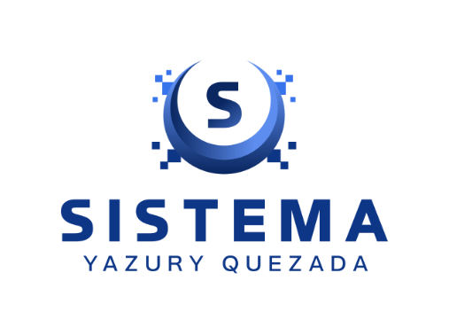
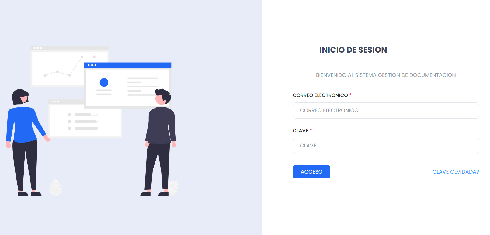

  

<h3 align="center">SYQ • Soluciones Digitales</h3>

Marca digital enfocada en el desarrollo de sistemas web modernos, funcionales y adaptables a las necesidades de empresas e instituciones.

 

<h1 align="center">📁 Sistema Gestor de Archivos</h1>

Plataforma web desarrollada para la administración, organización y gestión segura de archivos empresariales.

 

  
  
  

 

---
 

## ✨ Características Principales

- 📂 Gestión de carpetas y archivos PDF
- 👥 Sistema de roles (Administrador y Empleado)
- 📧 Compartir archivos mediante correo electrónico
- 🔒 Visualización segura de documentos clasificados
- 🧩 Arquitectura organizada por módulos y capas
- 📱 Diseño totalmente responsive
- 🔍 Organización eficiente de archivos digitales
- 🔐 Sistema de autenticación y control de acceso
- 📄 Visualización de documentos directamente desde la plataforma

---
 

## 🚀 Beneficios

- Optimiza la organización documental empresarial
- Reduce el uso de documentos físicos
- Facilita el acceso rápido a archivos
- Mejora el control y seguridad documental
- Permite compartir archivos de manera eficiente

---
 

## 🛠️ Tecnologías Utilizadas

  
  
  
  
  
  

---
 

## 🌍 Implementación en Entorno Real

Actualmente este sistema está siendo utilizado en una empresa privada para la administración y organización de archivos internos.

---
 

## 📸 Funcionalidades del Sistema

### 🔐 Inicio de Sesión
Sistema seguro de autenticación con control de acceso por roles.

### 📂 Gestión de Archivos
Administración de archivos y carpetas empresariales desde una única plataforma.

### 📧 Compartir Archivos
Permite compartir documentos mediante correo electrónico con notificaciones automáticas.

### 📱 Diseño Responsive
Interfaz adaptable a computadoras, tablets y dispositivos móviles.

---
 

## ⚠️ Aviso

El código fuente de este sistema no se encuentra disponible públicamente debido a que la licencia del software se encuentra actualmente en proceso de comercialización y venta.

---
 

## 📩 Contacto

Si deseas una demostración o adquirir este sistema, puedes contactarme:

📧 **sistemayq@gmail.com**

📱 **+1 (809) 315-9931**

💼 LinkedIn:  
https://www.linkedin.com/in/yazuryquezada

---

✨ Desarrollado por SYQ • Soluciones Digitales

